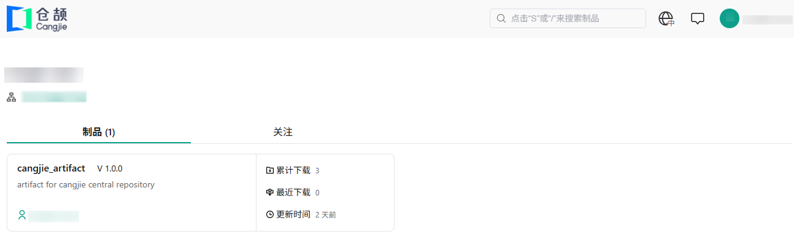
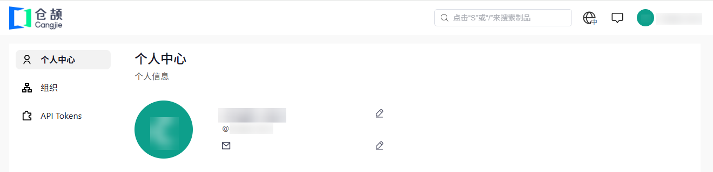
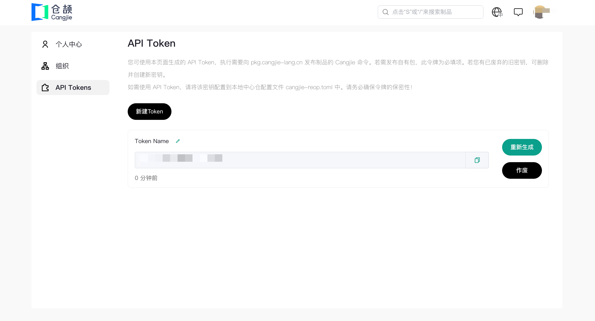
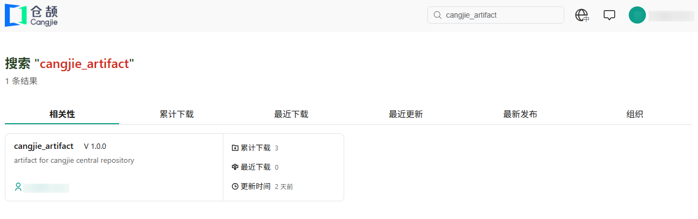
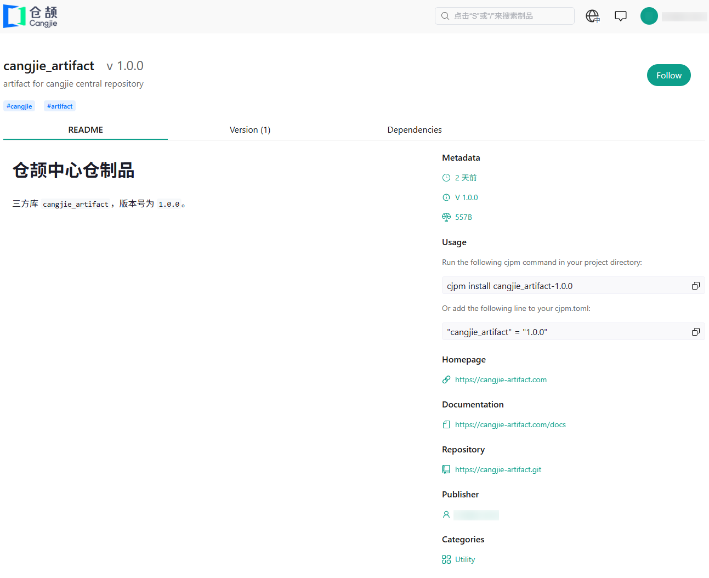
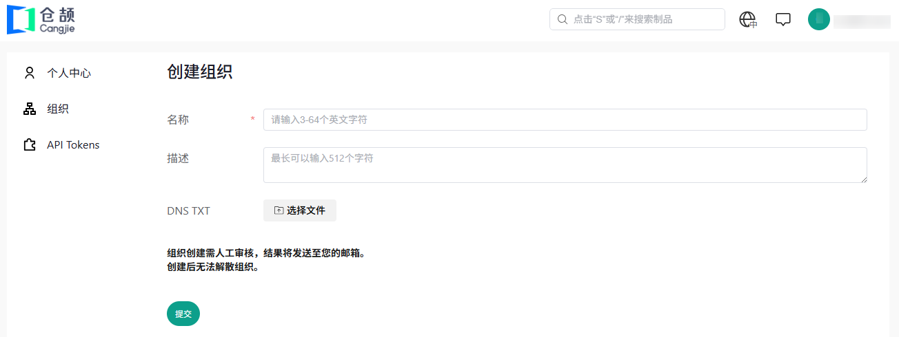
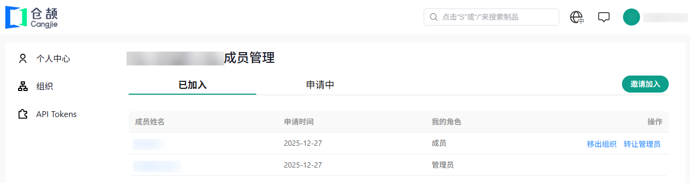

# 中心仓官网

[中心仓官网](https://pkg.cangjie-lang.cn)是中心仓前端网页，提供账户操作、制品查询、组织管理等功能。

## 注册账号

官网右上角的“登录”按钮用于注册中心仓账号，或是登录现有账号。

若用户登录了 GitCode 账号，则可以直接验证并登录中心仓。除 GitCode 外，中心仓还支持登录界面内“其他登录方式”一栏中列举的方式登录。

## 个人信息

登录后，在官网右上角可以看到用户名和头像。点击用户名或头像，可以进入个人主页，查看用户的个人信息、上传的制品以及关注列表。

光标移动到用户名或头像，可以在下拉框中进入个人中心页面，在此可以查看或修改个人信息，或是查看自己创建或加入的组织列表。

此外，用户还可以在个人中心页面进行用户 token 相关操作，包含新建、刷新、删除等操作，获取的用户 token 用于中心仓客户端的[仓库配置](./client/config.md#仓库配置)。

## 制品信息

在中心仓页面顶部搜索框中输入制品名，即可搜索仓库中的制品。键入 `shift + s` 或 `/` 可快速进入搜索框。搜索框也可以用来搜索组织。

目前，搜索功能仅支持前缀搜索。

点击制品条目，可以进入制品详情页面，查看制品的一些信息，包括 `README`、作者、标签、制品主页等。

## 组织管理

在个人中心的组织页面可以申请创建组织，组织名命名规范详见[中心仓制品规格](./artifact.md)。组织名涉及一些知名企业时，还需要用户提供企业域名的 DNS TXT Record 证明，否则无法通过审核。不符合法律法规的组织名也无法通过审核。

创建组织后，创建者默认成为组织的**管理员**，每个组织有且仅有一个管理员。管理员可以通过个人中心的组织页面进入对应组织的管理页面以管理组织，包括邀请成员、删除成员、转让管理员等操作。

组织和组织内制品也可以通过搜索框进行搜索。